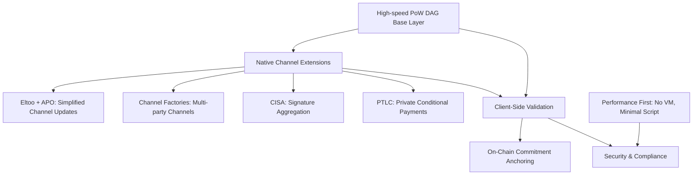
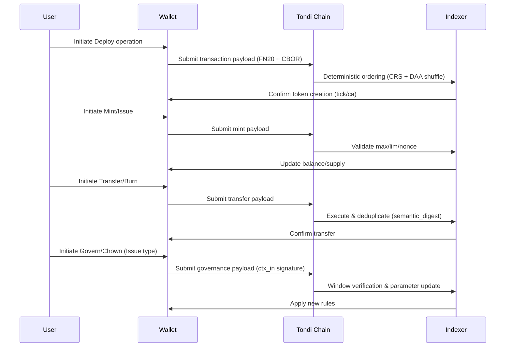
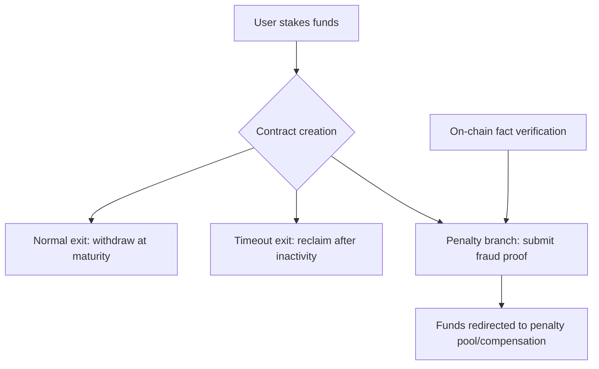

# Tondi Chain Whitepaper
## I. Project Overview: Unlocking the Performance Boundaries of Future Money

**Tondi** is a next-generation high-performance transaction settlement and Layer 2 anchoring base chain jointly developed by **Avato Labs** and the **Tondi Foundation**. It inherits the DAG architecture of Kaspa (the world’s fastest PoW chain), achieving breakthroughs in throughput, privacy protection, security, and compliance.

Tondi is defined as a **“High-Performance PoW Programmable Settlement Layer”**, designed specifically for high-frequency trading, stablecoin settlement, compliant privacy payments, and **off-chain state anchoring and channel extensions** in core Web3 scenarios.

It is not an extension of BTC or Kaspa solutions, but a brand-new architecture: built on a high-speed PoW DAG base layer, combined with **Eltoo, Channel Factories, CISA, PTLC, and APO**, forming a next-generation scalable settlement paradigm for the Bitcoin ecosystem.

It is not only a high-performance base layer chain but also the ideal hosting platform for the maturation of the RGB protocol, natively supporting BTC Taproot-based Layer 2 contract structures. It is the first protocol fully compatible with the BTC Taproot ecosystem, significantly surpassing its performance and privacy limitations.

---

## II. Layer 2: RGB on Tondi

### 2.1 Background and Historical Context

In the Bitcoin community, how to expand Layer 2 has always been a long-term core issue.

**Lightning Network (LN)**, proposed in 2015, has long been regarded as Bitcoin’s primary scaling solution. However, in practice, it gradually exposed multiple problems: complex channel fund management, unstable routing, difficult offline arbitration, and poor user experience, which resulted in limited global adoption.

To address these issues, the **RGB protocol** (since 2018) attempted to extend Bitcoin’s asset and contract layer through **client-side validation + Taproot commitments**. Avato Labs has been deeply involved in RGB’s R&D and productization over the past two years. In **version v0.12**, RGB is already mainnet-ready, and we have accumulated full implementation experience in wallets, stash management, and contract execution.

However, RGB encountered two major challenges in promotion:

1. **Excessive complexity** — State synchronization, stash management, and client proof systems are extremely large, raising the threshold and hindering mass adoption.
    
2. **Centralization dependence** — Although theoretically client-validated, in practice the ecosystem often relies on indexers and relay nodes, deviating from the original spirit of decentralization.
    

At the same time, Bitcoin Core developers have proposed multiple BIPs in recent years, but due to conservatism in security and consensus, they have yet to be adopted into Bitcoin mainnet:

- **ANYPREVOUT (APO)**: Core proposal simplifying channel updates, enabling the Eltoo protocol.
    
- **CISA**: Cross-input Schnorr signature aggregation, significantly reducing transaction size.
    
- **CTV (CheckTemplateVerify)**: Covenant-based transaction template verification primitive.
    
- **PTLC**: Privacy-enhanced conditional payment replacing HTLC.
    

These proposals have stagnated on the Bitcoin main chain, but their **engineering and economic value is undeniable**. Tondi, based on this reality and Avato Labs’ long-term R&D in RGB, opens a new path: by combining a high-speed PoW DAG public chain + native channels and aggregated signatures, it forms a more efficient, simpler alternative to RGB + Lightning.

---

### 2.2 An Alternative to RGB + Lightning

Tondi’s strategic goal is to use the **high-speed PoW DAG public chain** as the backbone, combined with **native Layer 2 channel extensions and privacy protocols**, to build a new path directly replacing **RGB + Lightning**:

- **RGB’s asset extension functions** → handled by Tondi’s covenant primitives (CTV, Vault) and the **FUN20** standard.
    
- **Lightning’s payment channel functions** → provided by Tondi’s native support for **APO + Eltoo + Channel Factories + CISA + PTLC**.
    

This means:  
👉 Tondi is not “compatible with RGB+LN,” but rather provides a **more natural, more efficient, more decentralized** alternative architecture.

---

### 2.3 Technical Design Principles

**Core Philosophy**:  
“The simpler the on-chain layer, the stronger the channels, and the more reliable the scalability and privacy.”

#### 1. High-Speed Settlement Layer

- **Consensus**: Based on GHOSTDAG, throughput performance is **1–2× Kaspa**.
- **Hashing**: Uses Blake3, throughput far beyond SHA256.
- **TPS**: Peak 15,000–25,000, confirmation latency 1–2 seconds.
- **Model**: Maintains stateless UTXO structure, avoiding global account bloat.
    

#### 2. Native Channels and Aggregated Signatures (Channels First)

- **ANYPREVOUT (APO)**: Simplifies channel update logic, foundation of Eltoo.
- **Channel Factories**: Support multi-party batch channels, reducing on-chain footprint.
- **CISA**: Cross-input Schnorr aggregation, reducing transaction size by 30–50%.
- **PTLC**: Enhances privacy and conditional payment capability.
    

👉 Combined, these modules form a native Layer 2 system that can replace **RGB+Lightning**, without relying on complex client state synchronization and centralized relays.

#### 3. Performance First, Security Minimalism

- **No general-purpose VM**, only Taproot-compatible script paths and covenant primitives (CTV, Vault, etc.).
    
- **Client-side validation first**: All channel and L2 protocol execution is wallet-side, only commitments submitted on-chain.
    
- **Hardware friendly**: Resource efficiency and privacy superior to Solana, extremely low operating threshold.
    

---

### 2.4 Technical Insights

1. **RGB pain points → Tondi’s solutions**
    
- RGB requires complex stash synchronization → Tondi’s **Eltoo + APO** directly resolves state update conflicts.
- RGB heavily depends on indexers/relays → Tondi’s **Channel Factories** essentially “trustlessly decentralize” channel expansion.
- RGB script limitations → Tondi provides more intuitive security models via **CTV, Vault, PTLC**.
    

2. **Lightning pain points → Tondi’s solutions**

- LN’s HTLCs expose payment paths → Tondi’s **PTLC** hides conditions, enhancing privacy.
- LN routing efficiency is low → Tondi’s **channel factories** + **CISA aggregation** improve liquidity and throughput.
- LN’s UX is poor → Tondi’s **APO+Eltoo** simplify channel updates, avoiding frequent on-chain arbitration.
    

---

### 2.5 Application Scenarios

- **Stablecoin settlement networks**: Low fees, high privacy, FATF-compliant interfaces.
- **High-frequency trading & micropayments**: ≥20 bps, 15,000–25,000 TPS, suitable for DeFi matching & content payments.
- **BTC Layer 2 state anchoring**: Optimal anchor for RGB & Taproot Assets.
- **Compliant privacy payments**: Selective viewing & zero-knowledge auditing, serving banks and regulators.
- **Rollup & state channel data layer**: More efficient fallback for ETH/BTC L2.

---

## III. FUN20: Tondi’s Native Lightweight Verifiable Fungible Token Standard (Lite)

### 3.1 Positioning

FUN20 is an **inscription-style token protocol** designed for Tondi: embedding the minimal necessary logic into **transaction payloads**, with **determinism, compactness, extensibility, and interoperability** as its core principles. It serves stablecoins, enterprise assets, and DeFi liquidity scenarios. It borrows simplicity from BRC-20/Runes but is comprehensively enhanced in **deterministic execution in a DAG environment, MEV resistance, governance, and cross-chain/zk extensions**.

### 1) Design Highlights

- **Ultra-compact payloads (per operation upper limits)**:  
    Transfer/Burn/Mint ≤ **64B**; Issue/Govern ≤ **96B**; Deploy ≤ **128B**.  
    Target: significantly reduce bandwidth and cost in high-throughput DAG environments.
    
- **Deterministic replay + MEV resistance**:  
    Adopts **CRS (Canonical Resolution Spec)** for deterministic event ordering (DAA score → txid → input order → payload order → digest), and uses DAA-seeded random shuffle to resist frontrunning.
    
- **Strict secure encoding**:  
    Header **“FN20”+version** fixed; **deterministic CBOR** (only unsigned integer keys, strictly ascending, no indefinite length, no duplicate keys, shortest integer encoding); UTF-8/NFC normalization; homoglyph interception.  
    Core parsers require **formal verification** (TLA+/Coq).
    
- **Dual deployment models (two token types)**:
    
    - **Deploy-Mint**: Open minting, globally unique by `tick`, supports per-mint limit `lim` and optional preallocation `pre`.
        
    - **Deploy-Issue**: Issuer-managed, identified by **contract address (CA)**, supporting continuous issuance, blacklist, ownership transfer `chown`, and lightweight governance `govern`.
        
- **Ecosystem expansion readiness**:  
    Reserved fields for **zk/bridge** (`l1_root`/`proof_*`, reserved `lock/release/evm_call` operations), for integration with **EVM/zkRollup/DA**.
    

---

### 2) Wire Format and Encoding

- Header: `"FN20"` + 1-byte `version=0x01` → followed by **deterministic CBOR payload**.
    
- **Array/map dual forms**: Support **fixed-order arrays** to further reduce size by 20–30%; semantics normalized to map form, duplicates prevented via `semantic_digest`.
    
- **Address**: Raw binary 20/32B (auto/prefix type indicator), unified derivation of `addr_ns` as index key.
    

---

### 3) Operation Set (`op`)

- `deploy`: Create token (Mint: `tick/max/lim/dec`; Issue: `name/ca/max/dec`, CA deterministically derived from deployment data).
    
- `mint` / `issue`: Open minting or issuer issuance (rate-limited by `max/lim` and policies).
    
- `transfer` / `burn`: Transfer and burn.
    
- `blacklist` (Issue): Policy-layer blacklist (**consensus record + client/indexer execution**).
    
- `chown` (Issue): Ownership/issuance right transfer (supports transfer of issuance rights only).
    
- `govern` (Issue): Lightweight governance, updates parameters (`max/dec/metadata`) via window/quorum voting.
    

> Operations requiring permission changes bind via `ctx_in` signature input; `nonce` monotonically increases by `(addr_ns, tick|ca)`, tolerant of DAG reordering.

---

### 4) Limits and Policies

- **Hard caps**: per-operation size caps as above; **≤16 FUN20 payloads per tx**; **≤2000 payloads per DAA epoch** (anti-spam).
    
- **Numbers & text**: Big-int shortest big-endian; `tick` length 3–8, `[a–z0–9]`; `dec` 0–18.
    
- **Anti-abuse recommendations (non-consensus)**: suggest ≤4 payloads per tx; ≤64 per address per 60s; dust auto-aggregation/fee conversion.
    

---

### 5) Wallet & Indexer Expectations

- **Wallets**: Deterministic encoding; local pre-checks (`max/lim/dec/nonce/balance`); return **standard error codes**; display governance proposals/votes; prefer array encoding.
    
- **Indexers**: Support array/map; implement CRS+shuffle; provide `/balance /supply /ops /owners /blacklist /govern /next-nonce` standard APIs.
    

---

### 6) Security & Compliance

- **Domain-separated digests** (event/semantic/batch root) + explicit error codes.
    
- **Chain isolation** (`chain` field) + expiry/replay protection (`nonce/expiry`).
    
- **Selective disclosure/view keys** for metadata; compliance audit & enterprise-ready.
    

---

### 7) Activation & Milestones

- **Frontier testnet first**: Rust/Go/TS SDK + extended test vectors; indexer API alignment + external audit.
    
- **Mainnet sync activation (v2026a)**: launched only after consistency/formal/security audit & governance approval.
    

---

## IV. Technical Architecture & Advantages

Tondi is a reference project for next-generation PoW settlement chains, combining GHOSTDAG, P2TR, Blake3, and Schnorr batch signatures to redefine throughput and privacy standards.

|Module|Key Features|
|---|---|
|Consensus|GHOSTDAG (parallel blocks + Blue Block weighting)|
|Hashing|Blake3, far superior to SHA256, SIMD support|
|UTXO Model|BTC-homomorphic, P2TR supported|
|Signatures|Schnorr batch signatures + parallel verification|
|Block frequency|Dynamic ≥10 blocks/sec, auto-adjust|
|Transaction processing|Parallel mempool ordering & validation, supports 10k+ TPS|

### Comparative Analysis:

- **Vs. Bitcoin (BTC)**
    
    - Throughput tens of times higher (7 TPS vs. 15,000–25,000 TPS)
        
    - Unified privacy structure, no path leakage
        
    - Anchoring: only commitments submitted, ideal for RGB & Taproot assets
        
    - Investment highlight: Optimal L2 settlement platform for BTC-native assets
        
- **Vs. Solana**
    
    - No account model, no global state sync, low hardware requirements
        
    - Confirmation independent of state scheduling, no GPU dependency
        
    - Investment highlight: Solana alternative under decentralized PoW architecture
        
- **Vs. ETH Rollups**
    
    - No general-purpose VM, focuses on state anchoring & throughput optimization
        
    - Cost structure independent of ETH Gas
        
    - Supports RGB / SBT / DAO client execution
        
    - Investment highlight: Flexible anchoring base layer for high-frequency scenarios
        

---

## V. Consensus & Governance: PoW + Conditional Staking

### 5.1 Design Intent

Tondi remains rooted in **PoW proof-of-work**, the strongest security foundation. On top of this, we add **Conditional Staking**, a mechanism to constrain and incentivize honest participation in specific scenarios. Thus, PoW ensures chain security and decentralization, while staking provides “bonds” and “verifiable penalties” for key behaviors.

This is not meant to replace PoW’s primacy, but to expand governance possibilities without sacrificing decentralization.

---

### 5.2 Conditional Staking Mechanism

Conditional staking relies on **Taproot extension scripts and simple covenant primitives**, e.g., via CTV or equivalents, creating a three-way exit staking contract:

1. **Normal exit**: safe withdrawal after agreed maturity.
    
2. **Timeout exit**: reclaim after prolonged inactivity.
    
3. **Penalty branch**: upon submission of verifiable fraud evidence, funds redirected to penalty pool or victim.
    

Emphasis: **verifiability** — only on-chain provable facts (e.g., double-signing, conflicting tx) can trigger penalties, avoiding human arbitration.

---

### 5.3 New Governance Possibilities

With conditional staking, Tondi can support governance scenarios hard to automate on traditional PoW chains:

- **Infrastructure guarantees**: relay/observer/channel hubs stake to guarantee service; malicious/violating behavior penalized via proofs.
    
- **Cross-chain & channel safety**: In Eltoo/channel factories, attempts to submit outdated states can be penalized, removing need for arbitrators.
    
- **Parametric governance**: Protocol parameters (e.g., fee caps, bandwidth allocation) can be modified via staked proposals. Abuse punished by stake slashing.
    
- **Accountable governance**: Staking makes “commitment with cost” possible — governance becomes binding, not costless signaling.
    

---

### 5.4 Philosophical Insight

PoW should not be replaced, but neither must it be isolated. With conditional staking, Tondi does not alter PoW’s core but adds a flexible governance texture atop its hardened shell. Thus, the network remains secure under hashpower while evolving sustainably under community accountability.

---

## VI. Evolution Mechanism: Biannual Steady Upgrades

### 6.1 Background & Issue

Blockchain’s paradox: **too fast risks errors, too slow risks stagnation**. Bitcoin’s conservatism makes it robust but stalls many proposals; other chains’ aggressive upgrades bring compatibility and security risks.

Tondi seeks balance. We introduce a **biannual evolution cadence** and a permanent experimental network — **Tondi Frontier**.

---

### 6.2 Biannual Rhythm

- **Version cadence defined by DAA score (difficulty adjustment metric)**, not rigid block heights.
    
- Every 6 months = a new evolution epoch.
    
- Mainnet upgrades possible at epoch boundaries.
    
- Minor updates can be governed mid-epoch.
    

Predictability without rigidity.

---

### 6.3 Role of Tondi Frontier

Frontier is not a one-off testnet, but a **never-reset experimental chain**:

- All features must run ≥1 epoch on Frontier before mainnet.
    
- Frontier adopts Kaspa improvements, Bitcoin proposals, Tondi’s own experiments first.
    
- Frontier has low incentives → reduced risk.
    
- Frontier stays structurally compatible with mainnet → easy migration/cross-validation.
    

---

### 6.4 Risks & Restraint

Not all innovations will enter mainnet. Some may be abandoned after Frontier testing. This is healthy: **mainnet stays conservative, Frontier stays bold**. Risk is isolated, evolution continuous.

---

## VII. Strategic Positioning & Competitive Landscape

|Dimension|Tondi|Kaspa|Solana|BTC|ETH L2|
|---|---|---|---|---|---|
|Consensus|GHOSTDAG (pruning+parallel)|GHOSTDAG|PoS+BFT|PoW (longest chain)|PoS / ZK|
|State model|Stateless (UTXO+commitments)|Stateless (pure UTXO)|Stateful (accounts)|Stateless|Stateful (sync required)|
|Contract support|Native FUN20 / RGB / Taproot L2 / channel factories|None|General VM|Minimal scripts|General VM|
|Privacy|Implicit (native RGB L2)|None|Low (account tracking)|None|Partial (e.g., Aztec)|
|Compliance|Privacy + selective disclosure|Low|Medium|High|Medium (ZK-dependent)|
|TPS theoretical|15,000–25,000|1,000–3,000|65,000|7|1,000–4,000|
|Finality|1–2s, fork-resistant|1–2s|0.4–0.8s|10m|sec–min|
|Complexity|Medium|Medium|High|Minimal but inefficient|High (proof dependent)|
|Investment|Very High|Medium|High|Saturated|High but concentrated|

---

## VIII. Copperfield Plan: Bitcoin’s Proving Ground for Unadopted BIPs

**Tondi as Bitcoin’s Proving Ground for Unadopted BIPs**

To further emphasize Tondi’s role as a BTC Taproot-native experimental chain, Avato Labs introduced the **Copperfield Plan** — turning Tondi into a **living experimental ground for BIP proposals not adopted or still debated**.

Dual objectives:

- **Validation for Bitcoin**: provide real-world environments for long-discussed proposals, generating reference data.
    
- **Preparation for the Next Era**: explore if Bitcoin’s “trilemma” (decentralization, security, scalability) can evolve dynamically, rather than stagnate in conservatism.
    

We believe: **inaction ≠ reduced risk**. Conservatism protects today’s Bitcoin, but experimentation prepares tomorrow’s.

---

### Copperfield Focus Areas

#### 🔹 Channel & Scalability Layer

- **ANYPREVOUT (TSP-0007)** – Eltoo & simplified channel updates
    
- **Channel Factories (TSP-0012)** – multi-party factories, reduced footprint
    
- **CTV (TSP-0009)** – covenant-based commitments
    

#### 🔹 Privacy & Signature Layer

- **PTLC (TSP-0010)** – privacy-enhanced conditional payments
    
- **CISA (TSP-0008)** – cross-input Schnorr aggregation
    
- **Native MuSig2 (TSP-0011)** – efficient multisig, consensus-integrated
    

#### 🔹 Performance & State Management

- **UTreeXO** – stateless client, Merkleized UTXO
    
- **AssumeUTXO** – fast node bootstraps via snapshot validation
    

#### 🔹 Extension Models

- **Ark** – UX-improved off-chain pools
    
- **Statechains** – transferable off-chain custodianship
    

#### 🔹 Covenant & Contract Layer

- **OP_VAULT** – delegated spending vaults
    
- **OP_CAT** – byte concatenation opcodes for covenant expressions
    
- **OP_CSFS** – checksum script validation for advanced contracts
    

#### 🔹 Applications & Standards

- **FUN20 (TSP-0006)** – inscription-like fungible token standard
    

---

### Experimentation Process & Community Feedback

Copperfield follows a **three-phase validation cycle**:

1. **Frontier phase** – rapid testnet implementation & trials
2. **Mainnet phase** – mature features deployed, run under load
3. **Reporting phase** – technical reports & real-world data → Bitcoin Core & BIP authors
    

As of Jan 2025, among 12 TSPs in progress:

- ✅ Implemented: 3
- 🔄 Under review: 3
- 📋 Draft stage: 5
- ✅ Accepted governance proposal: 1
    

---

### Strategic Philosophy

Bitcoin’s durability comes from conservatism, but progress comes from exploration.  
Tondi’s mission is not to compete with Bitcoin, but to serve as its **“wind tunnel laboratory”**:

- **Not weakening security**, but stress-testing attack surfaces & UX.
- **Not solving the trilemma**, but empirically testing decentralization/security/scalability trade-offs.
- **Not splitting Bitcoin’s path**, but filling its conservative gaps via experimentation.
    

Through Copperfield, Tondi aims to provide Bitcoin’s future with a clearer evolutionary path.

---

## IX. Conclusion: Unlocking Performance & Privacy in the Future Monetary Layer

Tondi is not chasing the illusion of a “universal platform,” nor reviving old anonymity coin narratives. It is a **base chain with technical conviction**: powered by DAG architecture, structured by Taproot + covenant constraints, pushing high-frequency payments & off-chain anchoring into true scalability.

We believe the future monetary layer must balance three axes: **performance, privacy tension, compliance interfaces**. Often seen as an impossible trilemma, Tondi’s minimalist + channel-first design provides a verifiable, testable venue for this tension.

- For engineers: Tondi is a laboratory, hosting unadopted Bitcoin proposals & frontier consensus in real-world environments.
    
- For enterprises & finance: Tondi is a settlement layer, enabling near-zero-friction stablecoins, cross-border payments, and HFT.
    

This is both an exploration of blockchain’s performance frontier and a union of hacker ethos with industry adoption.

---

### More Resources

- Website: [tondi.org](https://tondi.org/)
- Explorer: [explorer.tondi.org](https://explorer.tondi.org/)
- Dashboard (ETA Oct 2025): [dashboard.tondi.org](https://dashboard.tondi.org/)
- R&D Blog (EN): [avato.hashnode.dev](https://avato.hashnode.dev/)
