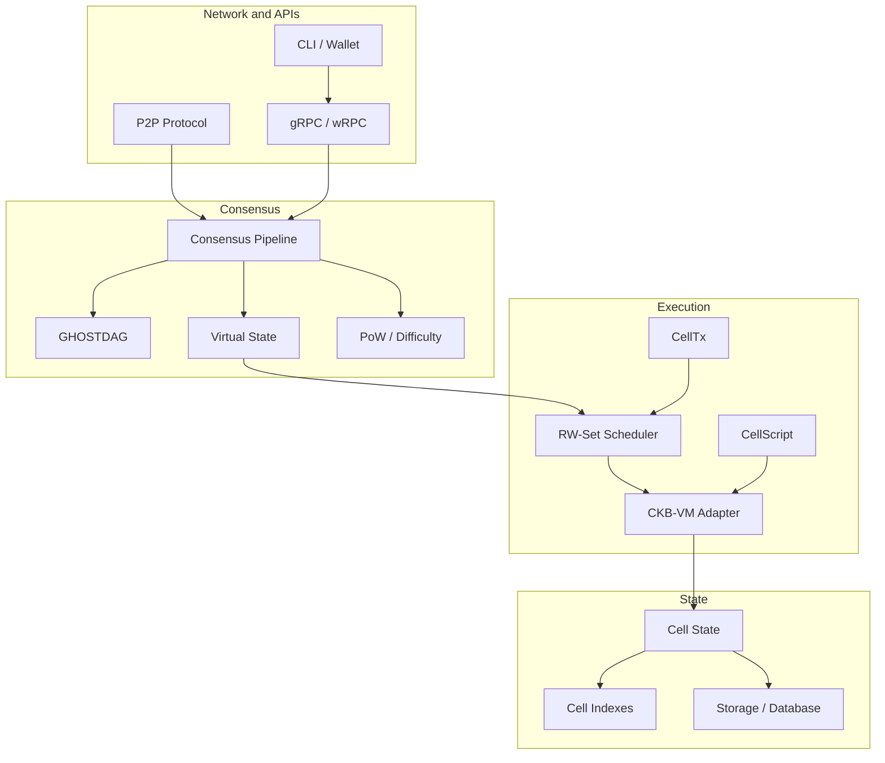
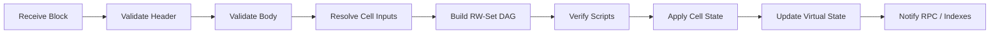
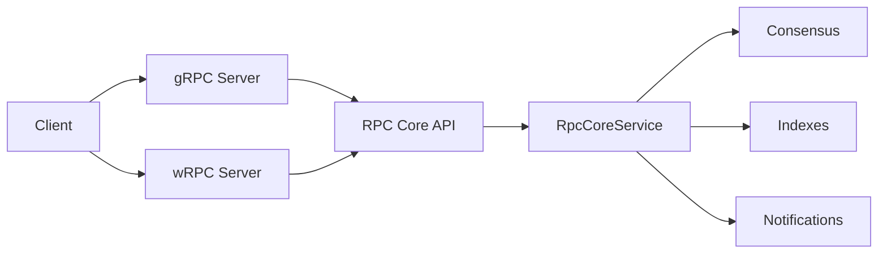

# Spora

Spora is a Rust-based blockchain framework that combines a GHOSTDAG consensus
core with a Cell-oriented transaction and execution model. It is designed for
parallel execution, deterministic state transitions, and modular node services.

The project is currently in an active architecture transition from legacy
transaction outputs to a Cell model inspired by CKB's cell semantics and VM
interaction style. APIs and internal module boundaries may still change.

## Branch Scope

This branch is the **SporaBFT** line. It targets an auditable, institution-grade
Cell state-transition runtime backed by BFT finality. The design prioritizes
provable accountability (ProofPlan), explicit owned/shared-cell parallelism,
and six-layer invariant verification over raw throughput.

The `spora-GhostDAG` branch preserves the prior DAG-oriented consensus
architecture (GHOSTDAG virtual-state processing, PoW/difficulty assumptions).
It is maintained as a research archive and future optional path; it is not the
canonical ledger consensus — final ordering and finality come from BFT checkpoints
on this branch.

## Highlights

- GHOSTDAG-based DAG consensus and virtual state processing.
- Cell transactions with lock/type/data fields and RW-set based scheduling.
- CKB-VM oriented execution layer with syscall adapters and script verification.
- CellScript, an experimental DSL for writing Cell-based contracts.
- Modular storage, indexing, mempool, mining, wallet, P2P, and RPC crates.
- gRPC and wRPC service layers for native and WebSocket-based clients.
- CLI tools for node operation, wallet workflows, simulation, and address tasks.

## CellScript Compatibility Boundaries

- CellScript supports Spora and CKB through explicit target profiles; CKB remains bounded to the admitted pure subset for v1.
- The CKB strict profile uses CKB syscall, source, hash, header, and Molecule rules.
- Molecule is the shared VM/CellScript ABI; legacy Borsh remains only on explicit legacy-only paths.
- The CKB strict profile does not accept Borsh as a public wire format.
- CellScript includes a beta package manager built around `Cell.toml`, local path/git dependencies, `Cell.lock`, package checks, and artifact policy gates.
- CellScript also includes beta language tooling: an in-crate LSP service for semantic editor features and a VS Code extension for syntax highlighting, snippets, diagnostics, and compiler-backed validation hooks.
- CKB load-script syscall identity is pinned for the strict profile:

```rust
pub const CKB_SYSCALL_LOAD_SCRIPT: u64 = 2052;
```

See [`cellscript/README.md`](cellscript/README.md) for the language syntax,
example contracts, package manager commands, and editor setup.

## Architecture



## Block Processing Flow



## RPC Layout



## Workspace Layout

| Path | Purpose |
| --- | --- |
| `consensus/` | Consensus pipeline, GHOSTDAG logic, virtual state, and PoW support. |
| `exec/` | Cell transaction types, scheduler, VM integration, and script execution. |
| `state/` | Cell state storage, indexing, and data availability related structures. |
| `mempool/` | Cell transaction pool and fee/scoring logic. |
| `rpc/` | Shared RPC models plus gRPC and wRPC implementations. |
| `protocol/` | P2P networking and protocol flows. |
| `wallet/` | Wallet core, native wallet, keys, BIP32, PSST, and WASM support. |
| `cli/`, `sporad/` | User-facing CLI and node daemon entry points. |
| `cellscript/` | CellScript compiler, standard library, tests, and examples. |
| `simpa/`, `treasure_boy/` | Simulation and utility tools. |

## Requirements

- Rust 1.85 or newer.
- `pkg-config`, OpenSSL, Clang, and libclang.
- On macOS, the checked-in `.cargo/config.toml` expects LLVM libraries under
  `/opt/homebrew/opt/llvm/lib`.
- A `shell.nix` is provided for a reproducible local development shell.

## Build

```bash
cargo build --workspace
```

For an optimized build:

```bash
cargo build --workspace --release
```

## Test

```bash
cargo test --workspace
```

Focused examples:

```bash
cargo test --package spora-exec
cargo test --package spora-state
cargo test --package spora-mempool
cargo test --package cellscript
```

## Common Commands

Show node options:

```bash
cargo run --bin sporad -- --help
```

Start the interactive CLI:

```bash
cargo run --bin spora-cli
```

Run the simulator help:

```bash
cargo run --bin simpa -- --help
```

Compile or inspect CellScript tooling:

```bash
cargo run --bin cellc -- --help
```

## Status

Spora is not a stable production interface yet. The current codebase prioritizes
the Cell migration, deterministic execution, and consensus/runtime integration
over backward compatibility with the previous legacy transaction-output model.

## License

Spora is licensed under the MIT License. See `LICENSE` for details.
