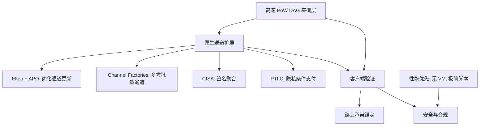
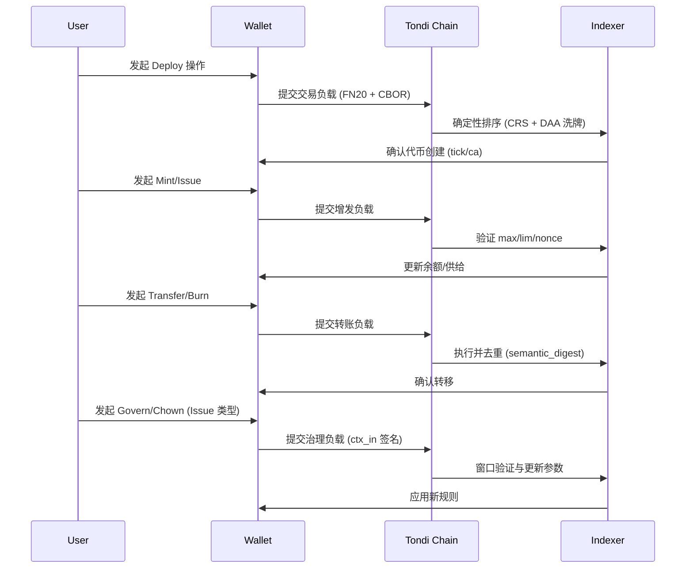
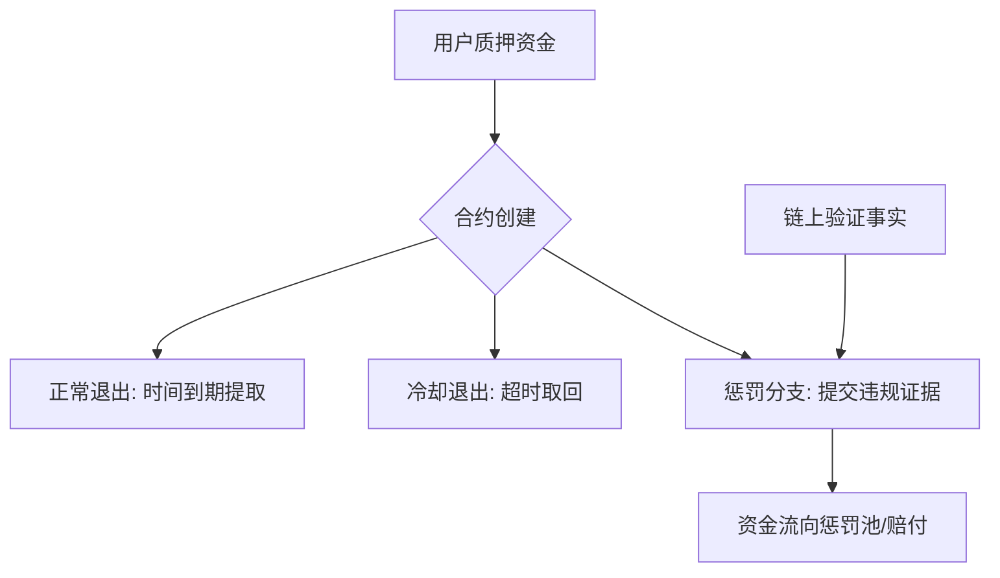

## 一、项目概述：解锁未来货币的性能边界

**Tondi** 是由 **Avato Labs** 和 **Tondi Foundation** 联合开发的新一代高性能交易结算与 Layer 2 锚定基础链，继承了 Tondi（全球最快 PoW 链）的 DAG 架构，在吞吐能力、隐私保护、安全性与合规性方面实现多项突破。

Tondi 被定义为一条 **“高性能PoW可编程结算层（High-Performance** **PoW Programmable Settlement Layer）”**，专为高频交易、稳定币结算、合规隐私支付以及核心 Web3 场景中的 **链下状态锚定与通道扩展** 而设计。

它并非 BTC 或者 Tondi 方案的延伸，而是一个全新的架构：以高速 PoW DAG 为基础层，结合 **Eltoo、Channel Factories、CISA、PTLC 与 APO**，形成下一代比特币生态的可扩展结算范式。

它不仅是一条性能强悍的底层链，更是 RGB 协议成熟化的理想承载平台，原生支持基于 BTC Taproot 的 Layer 2 合约结构，是首个全面兼容 BTC Taproot 生态、并显著超越其性能与隐私限制的协议。

---

## 二、Layer 2：RGB on Tondi

### 2.1 背景与历史脉络

在比特币社区，如何扩展 Layer 2 始终是长期的核心议题。

**Lightning Network (LN)** 自 2015 年提出以来，一直被视为比特币的主力扩容方案，但在实践中逐渐暴露出多个问题：通道资金管理复杂、路由不稳定、离线仲裁困难、用户体验不佳，导致其在全球范围的采用率始终有限。

为了解决这些问题，**RGB 协议**（自 2018 年起）尝试通过 **客户端验证 + Taproot 承诺** 机制，为比特币提供通用资产与合约扩展。Avato Labs 在过去两年中深度参与了 RGB 的研发与产品化工作，在 **v0.12 版本** 已经具备主网上线能力，并积累了钱包、Stash 管理和合约执行的完整实现经验。

然而，RGB 在推广过程中遇到了两大挑战：

1. **复杂度过高** —— 状态同步、Stash 管理与客户端证明体系极为庞杂，门槛高，难以规模化普及。
    
2. **中心化依赖** —— 尽管理论上是客户端验证，但实际生态往往依赖 indexer 与 relay 节点，背离了去中心化的原始精神。
    

与此同时，比特币核心开发者在过去数年中提出了多项 BIP，但因为安全性与共识的保守主义原因，迟迟未能进入 Bitcoin 主网：

- **ANYPREVOUT (APO)**：简化通道更新的核心提案，为 eltoo 协议提供支撑。
    
- **CISA**：跨输入 Schnorr 签名聚合，可大幅降低交易体积。
    
- **CTV (CheckTemplateVerify)**：基于 covenant 的交易模板验证原语。
    
- **PTLC**：替代 HTLC 的更隐私条件支付方式。
    

这些提案在比特币主链上停滞，但其 **工程与经济价值毋庸置疑**。Tondi 正是基于这一现实，结合 Avato Labs 在 RGB 上的长期研发积累，开辟出一条新的路径：通过高速 PoW DAG 公链 + 原生通道与聚合签名，形成比 RGB + Lightning 更高效、更简洁的替代方案。

---

### 2.2 RGB + Lightning 的替代方案

Tondi 的战略目标，是以 **高速 PoW DAG 公链** 为骨架，结合 **原生二层通道扩展与隐私协议**，构建一个能够直接替代 **RGB + Lightning** 的新路径：

- **RGB 的资产扩展功能** → 由 Tondi 的 covenant 原语（CTV、Vault）与 **FUN20** 标准承担。
    
- **Lightning 的支付通道功能** → 由 Tondi 原生支持的 **APO + eltoo + Channel Factories + CISA + PTLC** 提供。
    

这意味着：  
👉 Tondi 并不是“兼容 RGB+LN”，而是提供 **更自然、更高效、更去中心化** 的替代架构。

---

### 2.3 技术设计原则

**核心理念**：  
“链上越简洁，通道越强大，扩展与隐私就越可靠。”

#### 1. 高速基础层（High-Speed Settlement Layer）

- **共识**：基于 GHOSTDAG，吞吐性能为 Tondi 的 **1～2 倍**。
    
- **哈希**：采用 Blake3，吞吐远超 SHA256。
    
- **TPS**：峰值 15,000–25,000，确认延迟 1–2 秒。
    
- **模型**：保持无状态 UTXO 结构，避免全局账户膨胀。
    

#### 2. 原生通道与聚合签名（Channels First）

- **ANYPREVOUT (APO)**：简化通道更新逻辑，是 eltoo 的基础。
    
- **Channel Factories**：支持多方批量通道，减少链上 footprint。
    
- **CISA**：跨输入 Schnorr 聚合，减少交易体积 30–50%。
    
- **PTLC**：增强隐私与条件支付能力。
    

👉 这些模块组合后，形成一个可替代 **RGB+Lightning** 的原生 Layer 2 体系，而无需依赖复杂的客户端状态同步和中心化 relay。

#### 3. 性能优先，安全极简

- **不引入通用 VM**，仅保留 Taproot 兼容脚本路径与 covenant 原语（CTV、Vault 等）。
    
- **客户端验证优先**：所有通道与二层协议的执行由钱包完成，链上仅提交承诺。
    
- **硬件友好**：资源效率与隐私性优于 Solana，运行门槛极低。
    

---

### 2.4 技术 Insights

1. **RGB 的痛点 → Tondi 的解决**
    

- RGB 需要复杂的 Stash 同步，Tondi 的 **eltoo + APO** 直接解决状态更新冲突问题。
    
- RGB 强依赖 indexer/relay，Tondi 的 **Channel Factories** 本质上把通道扩展“去信任化”。
    
- RGB 脚本受限，Tondi 在 **CTV、Vault、PTLC** 等原语层面提供了更直观的安全模型。
    

2. **Lightning 的痛点 → Tondi 的解决**
    

- LN 的 HTLC 容易暴露支付路径，Tondi 的 **PTLC** 隐藏条件，提高隐私。
    
- LN 路由效率低，Tondi 的 **通道工厂** 和 **CISA 聚合** 提升流动性与吞吐。
    
- LN 用户体验差，Tondi 的 **APO+eltoo** 简化了通道更新，避免链上仲裁频繁触发。
    

### 2.5 应用场景

- **稳定币结算网络**：低费率、高隐私，支持合规接口（FATF 旅行规则）。
    
- **高频交易与小额支付**：≥20 BPS、15,000–25,000 TPS，适合 DeFi 撮合与内容支付。
    
- **BTC Layer 2 状态锚定**：作为 RGB 与 Taproot Assets 的最佳锚定平台。
    
- **合规隐私支付**：支持选择性视图与零知识审计，兼顾银行和监管需求。
    
- **Rollup 与状态通道数据层**：为 ETH/BTC L2 提供更高效的回退层。
    

---

## 三、FUN20：Tondi 原生的轻量可验证同质化代币标准（精简版）

### **3.1 定位**

FUN20 是为 Tondi 设计的 **铭文式（inscription-style）代币协议**：将最少必要逻辑写入**交易负载**，以**确定性（determinism）+ 紧凑性（compactness）+ 可扩展性（extensibility）+ 互操作性（interoperability）**为核心，服务稳定币、企业资产与 DeFi 流动性场景。它借鉴 BRC-20/Runes 的简洁，但在 **DAG 环境的确定性执行、MEV 抵抗、治理与跨链/zk 扩展** 上全面增强。

### 1) 设计要点

- **超紧凑负载**（按操作分级上限）：  
    Transfer/Burn/Mint ≤ **64B**；Issue/Govern ≤ **96B**；Deploy ≤ **128B**。  
    目标是在高吞吐 DAG 中显著降低带宽与费用。
    
- **确定性回放 + MEV 抵抗**：  
    采用 **CRS（Canonical Resolution Spec）** 对事件进行确定性排序（DAA 分数 → txid → 输入序 → 负载序 → 摘要），并以 DAA 种子**随机洗牌**抵抗抢跑。
    
- **严格安全编码**：  
    头部 **“FN20”+version** 固定；**确定性 CBOR**（仅无符号整型键、严格升序、无不定长、无重复键、最短整数编码）；UTF-8/NFC 规范；同形异义字符拦截。  
    关键解析器要求**形式化验证**（TLA+/Coq）。
    
- **双部署模型（两类代币）**
    
    - **Deploy-Mint**：开放铸造，按 `tick` 全网唯一，支持每次铸造上限 `lim` 与可选预分配 `pre`。
        
    - **Deploy-Issue**：由**合约地址（CA）**标识的发行人托管型，支持持续增发、黑名单、所有权转移 `chown` 与轻治理 `govern`。
        
- **生态扩展准备**：  
    预留 **zk/桥接**字段（`l1_root`/`proof_*`、保留 `lock/release/evm_call` 操作），便于对接 **EVM/zkRollup/DA**。
    

### 2) 线制（wire format）与编码

- 头部：`"FN20"` + 1 字节 `version=0x01` → 紧随**确定性 CBOR**负载。
    
- **数组/映射双形态**：支持**固定顺序数组**以再降 20–30% 字节；语义以**规范化映射**为准，防重复通过 `semantic_digest` 去重。
    
- **地址**：原始二进制 20/32B（自动/前缀指示类型），统一派生 `addr_ns` 作为索引键。
    

### 3) 操作集（`op`）

- `deploy`：创建代币（Mint：`tick/max/lim/dec`；Issue：`name/ca/max/dec`，CA 由部署数据确定性派生）。
    
- `mint` / `issue`：开放铸造或发行人增发（受 `max/lim` 与策略限流约束）。
    
- `transfer` / `burn`：转账与销毁。
    
- `blacklist`（Issue）：策略层黑名单（**共识记录 + 客户端/索引器执行**）。
    
- `chown`（Issue）：所有权/铸造权转移（支持仅转移铸造权）。
    
- `govern`（Issue）：轻治理，按窗口/法定人数更新参数（如 `max/dec/metadata`）。
    

> 需变更权限的操作通过 `ctx_in` 绑定签名输入；`nonce` 按 `(addr_ns, tick|ca)` 单调递增并容忍 DAG 重排。

### 4) 上限与策略

- **硬上限**：单操作负载上限如上；**每笔 ≤16 个 FUN20 负载**；**每 DAA 周期 ≤2000** 个负载（防垃圾）。
    
- **数字与文本**：大数最短大端；`tick` 长度 3–8，`[a–z0–9]`；`dec` 0–18。
    
- **反滥用建议（非共识）**：建议每 tx ≤4 负载；每地址 60s ≤64；Dust 自动聚合/费用化。
    

### 5) 钱包 & 索引器期望

- **钱包**：确定性编码；本地预检 `max/lim/dec/nonce/余额`；返回**标准错误码**；显示治理提案与投票；优先使用**数组编码**。
    
- **索引器**：同时支持数组/映射；实现 CRS+洗牌；提供 `/balance` `/supply` `/ops` `/owners` `/blacklist` `/govern` `/next-nonce` 等标准 API。
    

### 6) 安全与合规

- **域分离摘要**（事件/语义/批根）+ 明确错误码；
    
- **链隔离**（`chain` 字段）+ **过期/重放保护**（`nonce/expiry`）；
    
- **选择性披露/视图密钥** 友好元数据；支持合规审计与企业场景。
    

### 7) 激活与里程碑

- **Frontier 测试网先行**：Rust/Go/TS SDK + 扩展测试向量；完成索引器 API 对齐与外部审计；
    
- **与主网同步激活（v2026a）**：通过一致性/形式化/安全审计与治理批准后上线。
    

---

## 四、技术架构与优势

Tondi 是新一代 PoW 结算链的样板工程，融合 GHOSTDAG、P2TR、Blake3 和 Schnorr 批签名，重塑吞吐与隐私标准。

|模块|核心特性|
|---|---|
|共识机制|GHOSTDAG（平行区块 + Blue Block 权重）|
|哈希算法|Blake3，性能远优于 SHA256，支持 SIMD|
|UTXO 模型|与BTC基本同构、支持 P2TR|
|签名算法|Schnorr 批签名 + 并行验证|
|出块频率|动态 ≥10 区块/秒，自动调整|
|交易处理|并行 mempool 排序与验证，支持万级 TPS|

### 对比分析：

- **对比比特币（BTC）**
    
    - 吞吐量高出数十倍（7 TPS vs. 15,000–25,000 TPS）
        
    - 隐私结构统一，不暴露路径
        
    - 锚定方式：仅提交承诺，适合 RGB 与 Taproot 资产
        
    - 投资亮点：BTC 原生资产的最优 L2 结算平台
        
- **对比 Solana**
    
    - 无账户模型，无状态同步，硬件要求低
        
    - 确认时间不依赖状态调度，无 GPU 依赖
        
    - 投资亮点：去中心化 PoW 结构下的 Solana 替代方案
        
- **对比 ETH Rollup**
    
    - 不依赖通用 VM，聚焦状态锚定与吞吐优化
        
    - 成本结构独立于 ETH Gas
        
    - 支持 RGB / SBT / DAO 的客户端执行
        
    - 投资亮点：适用于高频场景的灵活锚定基础层
        

---

## 五、共识与治理：PoW 与条件质押的结合

### 5.1 设计初衷

Tondi 的基础依然是 **PoW 工作量证明**，这是最坚实的安全根基。我们在此之上加入了 **条件质押（Conditional Staking）** 的机制，用来约束和激励参与者在某些特定场景下保持诚实。这样，PoW 保证链的安全与去中心化，而质押则为某些关键行为提供“保证金”与“可验证惩罚”。

这种组合并不是要改变 PoW 的主导地位，而是希望在不牺牲去中心化的前提下，拓展出更多可行的治理空间。

### 5.2 条件质押的实现方式

条件质押依赖于 **Taproot 扩展脚本与简单 covenant 原语**，例如通过 CTV 或等价工具，创建一个三路出口的质押合约：

1. **正常退出**：在约定时间后可安全提取；
    
2. **冷却退出**：若长时间未操作，允许超时取回；
    
3. **惩罚分支**：一旦有可验证的违规证据提交，资金将按约定流向惩罚池或赔付对象。
    

整个设计强调 **可验证性**：只有链上可证明的事实（如双签名、冲突交易）才能触发惩罚，而不依赖人工判断。

### 5.3 新的治理可能性

借助条件质押，Tondi 能够支持许多传统 PoW 链难以自动化的治理场景：

- **基础设施保障**：中继节点、观测节点或支付通道枢纽可以通过质押提供服务保证。若出现恶意或违规行为，可由其他参与者提交证据触发扣罚。
    
- **跨链和支付通道安全**：在 Eltoo 通道、通道工厂等机制中，若有人试图提交过期状态，对手方可通过证据触发惩罚，从而免去仲裁人。
    
- **参数化治理**：某些协议参数（如交易费率上限、带宽分配等）可以通过带有质押担保的提案机制进行调整。若有人滥用提案权，质押便会成为一种天然的约束。
    
- **社区治理的可靠性**：质押让“言出必行”成为可能。治理不再是没有后果的表态，而是需要承担成本和责任的承诺。
    

### 5.4 哲学启示

我们认为 PoW 不应被替代，但它也不必孤立。通过条件质押，Tondi 并不是在改变共识的核心，而是在 PoW 的坚硬外壳上增添了一层柔性的治理肌理。这样一来，网络不仅能在算力的护持下保持安全，也能在社区共识的约束下保持可持续演进。

---

## 六、演进机制：半年一度的稳健更新

### 6.1 背景与问题

区块链的一个悖论是：**太快容易出错，太慢容易停滞**。比特币的保守让它坚固，但也让很多改进提案长期滞留；而部分新链的激进更新，则带来了兼容性与安全风险。

Tondi 试图在两者之间找到平衡。我们引入 **半年一度的演进节奏**，并建立一条长期存在的实验网络——**Tondi Frontier**。

### 6.2 半年节奏的具体方式

- **版本节拍由 DAA Score（难度调整积分）决定**，而不是死板的区块高度；
    
- 每六个月形成一个新的演进周期（Epoch）；
    
- 主网在每个周期边界上有机会进行一次主要升级；
    
- 在周期内部，可以通过社区治理决定是否进行小版本调整。
    

这种节奏既保持了升级的可预测性，又避免了过度僵化。

### 6.3 Tondi Frontier 的作用

Frontier 并非一次性测试网，而是一条 **永不重置的实验网络**。

- 所有新特性必须先在 Frontier 运行至少一个完整周期，才能进入主网；
    
- Frontier 会率先引入 **Tondi 的改进、Bitcoin 社区的提案、以及 Tondi 自己的实验性功能**；
    
- Frontier 的经济激励较小，从而降低实验风险；
    
- Frontier 与主网保持数据结构兼容，方便迁移和交叉验证。
    

### 6.4 风险与克制

我们承认，这种机制并不能保证所有创新都能顺利进入主网。Frontier 可能会出现一些最终被舍弃的特性。但我们认为，这是健康的生态信号：**主网保持保守，Frontier 保持勇敢**。通过这种分层，风险被隔离，进化被持续。

---

## 七、战略定位与竞争对比

|维度|Tondi|Tondi|Solana|BTC|ETH L2|
|---|---|---|---|---|---|
|共识机制|GHOSTDAG（修剪+并行）|GHOSTDAG|PoS + BFT|PoW（最长链）|PoS / ZK|
|状态结构|无状态（UTXO + 承诺）|无状态（纯 UTXO）|有状态（账户）|无状态|有状态（需同步）|
|合约支持|原生 FUN20 / RGB / Taproot L2 / 通道工厂|无|通用 VM|极简脚本|通用 VM|
|隐私能力|隐性（原生RGB L2支持）|无|低（账户可追踪）|无|部分（如 Aztec）|
|合规能力|隐私 & 选择性披露|低|中|高|中（视 ZK 类型）|
|TPS 理论值|15,000–25,000|1,000–3,000|65,000|7|1,000–4,000|
|确认速度|1–2 秒，抗分叉|1–2 秒|0.4–0.8 秒|10 分钟|秒级至分钟|
|架构复杂度|中|中|高|极简但低效|高（依赖证明）|
|投资潜力|极高|中|高|饱和|高但趋集中|

---

---

## 八、Copperfield Plan：比特币未采纳 BIP 的实验田

**Tondi as Bitcoin’s Proving Ground for Unadopted BIPs**

为进一步凸显 Tondi 作为 BTC Taproot 原生实验链的战略定位，Avato Labs 推出了 **Copperfield Plan** —— 将 Tondi 打造成一个 **比特币未采纳或仍处于争论阶段 BIP 提案的活体实验田**。

我们的目标是双重的：

- **验证与反馈（Validation for Bitcoin）**：为比特币社区讨论已久却迟迟未能落地的技术提案提供真实运行环境，生成可供参考的经验数据。
    
- **为下一时代做准备（Preparation for the Next Era）**：探索比特币“三难困境”（去中心化、安全性、可扩展性）是否可以动态演化，而不是停滞在极端保守的路径中。
    

我们相信：**不作为并非风险的降低**。保守确保了比特币当下的安全，但实验与探索才能为未来做好准备。

### Copperfield 聚焦的实验方向

#### 🔹 Channel & Scalability Layer

- **ANYPREVOUT (TSP-0007)** – 支持 Eltoo 与简化支付通道更新。
    
- **Channel Factories (TSP-0012)** – 多方通道工厂，减少链上 footprint。
    
- **CTV (TSP-0009)** – 基于 covenant 的交易承诺。
    

#### 🔹 Privacy & Signature Layer

- **PTLC (TSP-0010)** – 隐私增强的条件支付。
    
- **CISA (TSP-0008)** – 基于 Schnorr 的跨输入聚合签名。
    
- **Native MuSig2 (TSP-0011)** – 高效多签聚合，内建于共识规则。
    

#### 🔹 Performance & State Management

- **UTreeXO** – 无状态客户端，Merkle 化 UTXO。
    
- **AssumeUTXO** – 快速节点引导，基于快照验证。
    

#### 🔹 Extension Models

- **Ark** – 改进 UX 的链下支付池。
    
- **Statechains** – 可转移的链下托管模型。
    

#### 🔹 Covenant & Smart Contract Layer

- **OP_VAULT** – 带委托支出策略的安全保险库。
    
- **OP_CAT** – 字节拼接操作码，用于表达式 covenant 设计。
    
- **OP_CSFS** – 基于校验和的脚本验证，支持高级合约。
    

#### 🔹 Applications & Standards

- **FUN20 (TSP-0006)** – 类比 Inscription 的同质化代币标准。
    

### 实验流程与社区反馈

Copperfield 采用“三阶段验证循环”：

1. **Frontier 阶段** – 在 Tondi 测试网快速实现并试验新提案；
    
2. **Mainnet 阶段** – 将成熟功能纳入主网，结合高频应用运行；
    
3. **Reporting 阶段** – 输出技术报告与真实数据，反馈给 Bitcoin Core 与 BIP 作者。
    

截至 2025 年 1 月，Tondi 已经完成或推进中的 12 个 TSP 中：

- ✅ 已实现：3 项
    
- 🔄 审核中：3 项
    
- 📋 草案阶段：5 项
    
- ✅ 已接受治理提案：1 项
    

### 战略哲学

比特币的耐久性来自保守，但进步源于探索。  
Tondi 的使命不是与比特币竞争，而是作为它的“**风洞实验室**”：

- **不是削弱安全性**，而是提供真实世界的攻击面与 UX 数据；
    
- **不是打破三难困境**，而是实测去中心化、安全、扩展性之间的动态权衡；
    
- **不是分裂比特币路线**，而是以实验补足保守的缺口。
    

通过 Copperfield，Tondi 希望为比特币的未来提供一条更清晰的演进路径。

## 九、结语：在未来货币层中解锁性能与隐私

Tondi 并不是为了追逐“万能平台”的幻影，也不是为了重塑匿名币的旧叙事。它是一条**有技术立场的基础设施链**：以 DAG 架构为动力核心，以 Taproot 与条件约束为运行骨架，推动高频支付与链下状态锚定进入一个真正可扩展的时代。

我们相信，未来的货币层需要兼顾三个维度：**性能的极限、隐私的张力、合规的接口**。这三者通常被视为不可能三角，而 Tondi 通过极简设计与通道优先的策略，为这一张力提供了一个可以被验证、可以被试验的场所。

对工程师而言，Tondi 是一个实验室，容纳未被采纳的 Bitcoin 提案与前沿共识机制的真实运行；  
对企业与金融参与者而言，Tondi 是一个结算层，能以接近零摩擦的方式承载稳定币、跨境支付与高频交易。

这不仅是对区块链性能边界的探索，也是一次将极客精神与产业落地结合的尝试。

更多信息与资源：

- 官网：[tondi.org](https://tondi.org)
    
- 区块链浏览器：[explorer.tondi.org](https://explorer.tondi.org)
    
- 仪表盘：[dashboard.tondi.org](https://dashboard.tondi.org)
    
- 研发日志（英文）：[avato.hashnode.dev](https://avato.hashnode.dev/)