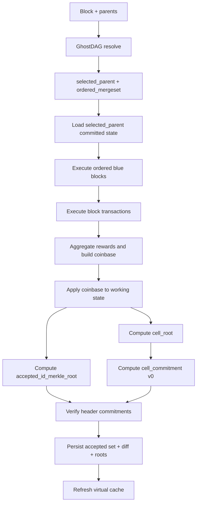

# Spora 共识架构 V2

- 日期: 2026-04-11
- 状态: Draft
- 目的: 作为新的协议级架构文档，替代“实现说明式”的旧文档
- 适用范围: `GhostDAG + Cell + CKB-VM` 的共识、状态、重组、模板构造、mempool 接口
- 替代参考: [spora_ghostdag_cell_architecture.md](/Users/arthur/RustroverProjects/Spora/docs/spora_ghostdag_cell_architecture.md)
- 评审摘要: [spora_consensus_v2_rfc_summary.md](/Users/arthur/RustroverProjects/Spora/docs/spora_consensus_v2_rfc_summary.md)
- 实现跟踪: [spora_consensus_v2_gap_analysis.md](/Users/arthur/RustroverProjects/Spora/docs/spora_consensus_v2_gap_analysis.md)
- Issue 清单: [spora_consensus_v2_issue_list.md](/Users/arthur/RustroverProjects/Spora/docs/spora_consensus_v2_issue_list.md)

## 1. 为什么要有 V2

旧文档更像“方向说明”和“实现理想图”，问题在于：

- 把若干过渡实现写成了既成协议
- 把 `DAA-only` 历史查询写成了 DAG 共识语义
- 没有把 `body validation`、`virtual state`、`mempool`、`template building` 的规则收敛成一套共享状态机
- 没有明确区分“规范层对象”和“缓存层对象”

V2 的目标不是描述当前代码“看起来如何”，而是定义：

- 什么才是协议里的真对象
- 一个块到底如何被判定为合法
- 状态如何被确定、承诺、回滚和重放
- Spora 与 CKB、Kaspa 的边界分别在哪里

## 2. 协议目标

Spora 的目标不是简单把 CKB 或 Kaspa 原样搬过来，而是组合两者的长处：

- 从 Kaspa 继承: `GhostDAG` 的排序、selected parent、mergeset、virtual、pruning
- 从 CKB 继承: `Cell` 状态模型、`lock/type script`、`since` 语义、VM 执行模型
- 在 Spora 中新增: `cell_root`、`cell_commitment`、`accepted_id_merkle_root` 三类显式承诺

V2 架构必须满足以下协议目标：

1. 每个块的合法性都能仅由其父上下文和块内容确定。
2. 同一组区块在任意节点、任意导入顺序下，都能得到相同 accepted 结果和相同状态根。
3. `virtual state` 只是缓存，不是规范对象。
4. 历史状态查询必须是 `POV-aware`，不能只靠 `DAA score`。
5. 脚本执行必须属于共识，而不是可选附加层。
6. 模板构造、mempool 准入、区块验证必须共用同一套状态转移语义。

## 2.1 一页结论

如果只记三句话，这份文档的结论是：

- Spora 不是“DAG 版 CKB”，也不是“带脚本的 Kaspa”，而是 `GhostDAG ordering + Cell state + VM execution` 的组合协议。
- 在 Spora 里，状态起点永远是 `selected_parent` 的已提交状态，绝不是当前 `virtual_state`，也不是某个 `DAA score` 的模糊快照。
- 只要 `body validation`、`reorg replay`、`mempool`、`template` 不共用同一个状态转移引擎，协议设计就还没有闭环。

## 3. 规范对象

### 3.1 共识对象

- `Header`
- `GhostdagData`
- `selected_parent`
- `ordered_mergeset`
- `accepted_tx_order`
- `cell_diff`
- `cell_root`
- `cell_commitment`
- `accepted_id_merkle_root`

### 3.2 缓存对象

- `virtual_state`
- `selected_chain cache`
- `window cache`
- `pruning samples cache`
- `mempool frontier`

缓存对象可以丢失、重建、回退，但不能改变协议结论。

### 3.3 明确不属于规范语义的对象

- `get_cell_at_daa(outpoint, daa)` 这种不带 POV 的历史接口
- 任何依赖“当前本地 virtual tip”的状态判断
- 任何只在模板构造里成立、但不在正式验块里成立的交易规则

## 4. 核心术语

### 4.1 POV

`POV block` 是状态查询的唯一视角锚点。  
任何“Cell 是否 live”“Cell 是否 mature”“输入是否可花费”的问题，都必须相对于某个 `pov block hash` 来回答。

### 4.2 Selected Parent State

每个块的状态计算，必须从其 `selected_parent` 已提交状态开始。  
不是从 `virtual_state` 开始，也不是从某个 `daa score` 对应的模糊快照开始。

### 4.3 Ordered Mergeset

Spora 继承 GhostDAG 的规则：

- `selected_parent` 决定基线状态
- `mergeset_blues` 按确定性拓扑顺序执行
- `mergeset_reds` 不执行其交易，仅影响奖励和 DAG 结构

### 4.4 Accepted Transaction Order

`accepted_tx_order` 是共识对象。  
它必须被 `accepted_id_merkle_root` 绑定，不能只是本地缓存副产物。

## 5. 协议不变量

以下不变量是 V2 的核心。

### 5.1 状态唯一性

给定：

- `selected_parent` 的已提交状态
- `ordered_mergeset`
- 当前块的交易集合
- 当前 VM 版本和脚本数据提供者规则

则：

- `accepted_tx_order`
- `cell_diff`
- `cell_root`
- `cell_commitment`

都必须唯一。

### 5.2 状态视角唯一性

一个 Cell 的 live/spent 判定，必须写成：

- `get_cell_at_pov(outpoint, pov_block_hash)`

而不是：

- `get_cell_at_daa(outpoint, daa_score)`

`DAA` 可以参与 maturity 和 time-lock 计算，但不能单独决定状态视角。

### 5.3 Virtual Non-Normativity

`virtual_state` 只能作为：

- block template 构造缓存
- mempool 评估缓存
- selected chain / sink 计算缓存

不能作为协议上的“真父状态”。

### 5.4 Script As Consensus

`lock script`、`type script`、cycles 计费、grouping 规则、syscall 数据提供者，必须属于共识。  
如果它们只是 optional helper，那么 Spora 不是完整的 Cell 协议。

### 5.5 Shared Transition Engine

以下路径必须共享同一套状态转移引擎：

- `body validation in context`
- `virtual processor`
- `reorg replay`
- `mempool admission`
- `block template validation`

任何一条路径如果只做“简化版检查”，都只能存在于临时迁移阶段，不能当正式协议设计。

## 6. V2 共识流程

### 6.1 Header / GhostDAG 阶段

输入:

- 区块头
- 父集合
- 已存在 DAG

输出:

- `selected_parent`
- `ordered_mergeset`
- `blue_score`
- `blue_work`
- `daa_score`

约束:

- 这是排序层
- 不在这里决定 Cell 状态

### 6.2 基线状态装载阶段

输入:

- `selected_parent`

输出:

- `selected_parent_committed_state`

定义:

- 这是唯一允许的状态计算起点
- 可由 `cell_root + cell_diff chain replay` 或增量快照重建
- 重建失败必须导致块拒绝，而不是 fallback 到当前 virtual

### 6.3 交易决策阶段

对 `ordered_mergeset` 中每个蓝块、以及待验证块自身的交易，按确定顺序处理：

1. isolation 检查
2. `POV-aware` 输入解析
3. capacity 守恒检查
4. `since` / time-lock 检查
5. cellbase maturity 检查
6. script group 构造
7. VM 执行与 cycles 验证
8. 应用到临时状态

对每笔非 coinbase 交易，只有两种结果：

- accepted
- rejected with deterministic reason

不允许：

- 缺失输入时 fallback
- 创建重复 outpoint 时静默覆盖
- 在不同路径上应用不同版本的规则

### 6.4 奖励与 coinbase 阶段

奖励规则继承 GhostDAG：

- 蓝块奖励按 mergeset / DAA 规则分配
- 红块仅参与奖励聚合，不执行其交易
- 当前块 coinbase 由 accepted mergeset 奖励结果确定

coinbase 不是“附加交易”，它必须是协议状态机的一部分，因为它改变 Cell 状态和承诺。

### 6.5 承诺阶段

从最终 accepted 结果生成三类承诺：

1. `accepted_id_merkle_root`
2. `cell_root`
3. `cell_commitment`

V2 约定：

- `cell_root` 只承诺 live cells
- `cell_commitment` 是版本化 wrapper
- 当前版本为 `H("spora/cell_commitment/v0" || cell_root)`

### 6.6 持久化阶段

若块验证成功，持久化以下数据：

- `cell_diff`
- `cell_root`
- `accepted_tx_order`
- `accepted_id_merkle_root`
- `reward metadata`
- `pruning sample`

持久化顺序必须保证：

- 崩溃恢复后不会出现“header 已接受、state 未提交”的半状态

### 6.7 Virtual 更新阶段

`virtual_state` 在块提交成功后更新。  
它只能依赖已提交的 block-local state 结果重建，不能反过来决定 block 的合法性。

### 6.8 规范伪代码

`accept_block(block)` 在协议层应当等价于：

```text
1. ghostdag = resolve_ghostdag(block.parents)
2. selected_parent = ghostdag.selected_parent
3. ordered_mergeset = order_mergeset(ghostdag)
4. parent_state = load_committed_state(selected_parent)
5. working_state = clone(parent_state)
6. accepted = []
7. for blue_block in ordered_mergeset.blues:
8.     for tx in blue_block.non_coinbase_txs:
9.         decision = validate_and_apply_tx(tx, working_state, pov=block.hash)
10.        if decision.accepted:
11.            accepted.push(tx.id)
12. apply_reward_aggregation(ordered_mergeset, working_state)
13. for tx in block.non_coinbase_txs:
14.     decision = validate_and_apply_tx(tx, working_state, pov=block.hash)
15.     if decision.accepted:
16.         accepted.push(tx.id)
17. coinbase = build_coinbase(block, ordered_mergeset, accepted)
18. apply_coinbase(coinbase, working_state)
19. accepted_root = merkle_root(accepted)
20. cell_root = live_cell_root(working_state)
21. cell_commitment = H("spora/cell_commitment/v0" || cell_root)
22. verify_header_commitments(block.header, accepted_root, cell_root, cell_commitment)
23. persist_block_state(block, accepted, working_state.diff, accepted_root, cell_root)
24. refresh_virtual_cache()
25. return accepted
```

这段伪代码的重点不是实现细节，而是协议边界：

- `validate_and_apply_tx(...)` 是唯一允许定义输入可花费性、capacity、`since`、maturity、VM 执行的地方。
- `accepted_root`、`cell_root`、`cell_commitment` 全都来自同一个 `working_state`。
- `virtual cache` 只会在块已经提交后刷新。

### 6.9 流程图



## 7. 历史查询设计

### 7.1 协议接口

协议级接口应当只有：

- `get_cell_at_pov(outpoint, pov_block)`

以及可选的批量版本：

- `batch_get_cells_at_pov(outpoints, pov_block)`

### 7.2 索引接口

`CellDB/get_cell_at_daa` 可以保留，但只能被定义为：

- 辅助索引
- 调试/分析接口
- 非共识接口

不能再在协议文档里把它写成 DAG 共识历史视角的正式定义。

## 8. Mempool 与 Template 的协议位置

### 8.1 Mempool

mempool 不是共识，但必须与共识兼容。

要求：

- 准入规则基于真实 `POV` 和共享状态机
- policy 与 consensus 明确分层
- `RBF`、`CPFP`、排序策略可以是 policy
- 输入可花费性、capacity 守恒、script 有效性不能只是 policy

### 8.2 Block Template

template builder 必须：

- 使用和正式验块相同的状态转移逻辑
- 生成与正式验证完全一致的
  - `accepted_id_merkle_root`
  - `cell_root`
  - `cell_commitment`
  - coinbase

否则 template 只是“本地候选块草稿”，不是协议一致块。

## 9. Reorg 设计

Reorg 的规范流程应当是：

1. 找到 split point
2. 从旧链回滚到 split point
3. 从 split point 沿新链 selected-parent 路径前推
4. 每个块都从其 selected parent 已提交状态开始重算
5. 每步验证：
   - `accepted_id_merkle_root`
   - `cell_root`
   - `cell_commitment`

禁止：

- 用当前 virtual tree 直接冒充 selected parent state
- 用“看起来接近”的 root 作近似恢复

## 10. 与 CKB 的对比

### 10.1 核心关系

Spora 不是 CKB 的分叉，也不是“把 CKB 放进 DAG”。  
它是：

- 用 Kaspa/GhostDAG 处理排序与多父
- 用 CKB/Cell 处理状态与脚本

### 10.2 共识流程对比

| 维度 | CKB | Spora V2 |
|---|---|---|
| 排序模型 | 单链 NC-Max | GhostDAG 多父 DAG |
| 父状态起点 | 唯一父块状态 | `selected_parent` 已提交状态 |
| 状态模型 | Cell | Cell |
| 状态视角 | 链高/父块天然唯一 | 必须显式 `POV block` |
| 交易执行顺序 | 区块内线性顺序 | `selected_parent + ordered_mergeset + block tx order` |
| reorg 语义 | 线性链回滚/重放 | split point 后按 selected-parent 路径重算 |
| 奖励模型 | 单 coinbase | mergeset 奖励 + coinbase 聚合 |
| VM 地位 | 共识核心 | 必须也是共识核心 |

### 10.3 旧 CKB 流程拆解

把旧 CKB 的主流程压缩成协议步骤，大致是：

1. 接收区块并检查 header、父块和 epoch 上下文。
2. 以唯一父块状态作为起点。
3. 线性验证区块内交易：
   - 解析输入 Cell
   - 检查 `since`
   - 构造 script groups
   - 跑 `lock/type script`
4. 应用交易对 Cell 集的增删改。
5. 处理 coinbase 和奖励。
6. 生成交易级承诺并提交新链状态。

CKB 的关键简化在于：

- 父状态天然唯一
- 区块顺序天然唯一
- reorg 只是链式回滚和重放
- 历史状态不需要单独定义 `POV`

### 10.4 Spora 相比 CKB 多出来的设计负担

- 必须定义 `POV`
- 必须定义 `ordered_mergeset`
- 必须定义 `selected_parent` 对状态的唯一决定作用
- 必须把 red block 与 reward 语义分离
- 必须区分 `virtual cache` 与 `consensus state`

换句话说，Spora 不能只“复用 CKB Cell 结构”，还必须补全 DAG 状态语义。

## 11. 与 Kaspa 的对比

### 11.1 核心关系

Spora 在排序层更接近 Kaspa，而不是 CKB。

Kaspa 已经解决的问题：

- selected parent
- mergeset
- virtual
- pruning
- accepted set

Spora 需要继承这些结论，但把 `legacy txout diff` 替换为 `Cell diff + VM execution`。

### 11.2 共识流程对比

| 维度 | Kaspa | Spora V2 |
|---|---|---|
| 排序模型 | GhostDAG | GhostDAG |
| 状态模型 | legacy txout | Cell |
| 状态转移 | legacy txout diff | Cell diff |
| 脚本模型 | 比特币脚本风格 legacy txout | CKB-VM lock/type script |
| accepted 集 | 共识核心 | 共识核心 |
| `accepted_id_merkle_root` | 有 | 有 |
| selected parent state | 共识核心 | 共识核心 |
| virtual | 缓存/派生对象 | 必须同样是缓存/派生对象 |
| 历史视角 | 链路上下文 | 必须显式 `POV` |

### 11.3 旧 Kaspa 流程拆解

把旧 Kaspa 的主流程压缩成协议步骤，大致是：

1. 接收新区块并更新 DAG。
2. 运行 GhostDAG，得到 `selected_parent` 和 `mergeset`。
3. 以 `selected_parent` 的 legacy txout 状态为起点。
4. 依顺序处理 accepted block / tx，生成 legacy txout diff。
5. 计算 `accepted_id_merkle_root` 等承诺。
6. 提交 block-local diff，并刷新 virtual。

Kaspa 的关键简化在于：

- 状态转移主要是 `legacy txout spend/create`
- 没有 CKB 式 `type script` 生命周期
- VM 和 data provider 复杂度远低于 Cell 协议
- accepted 集与状态根之间的耦合比 Spora 轻

### 11.4 Spora 相比 Kaspa 多出来的设计负担

- 输入不只是“有没有 legacy txout”，还要跑 VM
- 状态不只是 spend/create，还包含 type script 约束
- 历史查询不只是 diff replay，还要支持 Cell 语义
- mempool/template 与正式校验更容易出现分层漂移

换句话说，Spora 不能只“照着 Kaspa 做 virtual + accepted”，还必须把脚本和 Cell 生命周期正式并入协议。

## 12. 三者流程并排看

如果把三套协议都压缩成“块被接受时到底发生了什么”，可以直接并排看：

| 步骤 | CKB | Kaspa | Spora V2 |
|---|---|---|---|
| 1 | 选定唯一父块 | 运行 GhostDAG | 运行 GhostDAG |
| 2 | 载入父块状态 | 选定 `selected_parent` | 选定 `selected_parent` |
| 3 | 线性执行区块交易 | 处理 accepted tx / legacy txout diff | 处理 ordered mergeset + block tx |
| 4 | 运行脚本并应用 Cell 变化 | 生成 accepted 集和状态 diff | 运行 VM 并应用 Cell diff |
| 5 | 处理 coinbase / 奖励 | 计算 accepted 承诺 | 处理 mergeset reward + coinbase |
| 6 | 提交新链状态 | 提交 block-local diff 并更新 virtual | 计算 `accepted_id_merkle_root`、`cell_root`、`cell_commitment` 并提交 |

真正的分界线是：

- CKB 把难点放在脚本和状态表达
- Kaspa 把难点放在 DAG 排序和 accepted 集
- Spora 同时继承了两边最难的部分

## 13. 推荐的实现分层

V2 推荐把代码结构也对齐到协议结构。

### 13.1 Ordering Engine

负责：

- GhostDAG
- selected parent
- ordered mergeset
- pruning / finality / windows

### 13.2 State Transition Engine

负责：

- `apply_block_to_parent_state(...)`
- isolation/context/dag/script 全部校验
- accepted tx order
- reward aggregation
- `cell_diff`
- `cell_root`
- `cell_commitment`

这是协议的单一真相实现。

### 13.3 Persistence Layer

负责：

- state diff 持久化
- root 持久化
- accepted set 持久化
- prune-safe 恢复

### 13.4 Policy Layer

负责：

- mempool 排序
- RBF / CPFP
- relay 限制
- 标准性规则

policy 层不能重新发明一套共识规则。

## 14. “完美设计”需要达到什么标准

如果要把协议设计做到接近“完美”，至少要满足以下清单。

### 14.1 规范闭环

- 有一份唯一有效的协议文档
- 明确定义 block validity
- 明确定义状态视角
- 明确定义版本升级规则

### 14.2 实现闭环

- `body validation`
- `virtual/reorg`
- `mempool`
- `template`

全部调用同一个状态转移引擎。

### 14.3 证明闭环

- 多分支 DAG 模型测试
- 顺序无关性测试
- split/reorg 回放测试
- script 执行一致性测试
- second implementation / model checker 对拍

### 14.4 升级闭环

- `cell_commitment` 版本化规则
- VM 版本激活规则
- script syscall 兼容规则
- 历史 root 扩展规则

## 15. 落地顺序

如果要把现有实现真正推进到 V2，我建议按下面顺序落地：

1. 先冻结规范：
   - 以本文件为主文档
   - 旧文档降级为历史说明
   - 明确 `POV`、`accepted_tx_order`、`cell_commitment` 的规范定义
2. 再统一状态机：
   - `body validation`
   - `reorg replay`
   - `mempool`
   - `template`
   全部改成调用同一个 `State Transition Engine`
3. 再补脚本共识化：
   - 真实 data provider
   - cycles 计费
   - VM 版本与激活规则
4. 最后做证明和优化：
   - second implementation / model tests
   - 历史 root 扩展
   - 增量状态树和轻客户端证明

这个顺序的原因很简单：

- 不先冻结规范，后面的实现只能继续漂移
- 不先统一状态机，测试通过也不能证明协议闭环
- 不把 VM 纳入共识，Spora 仍然只是“带脚本字段的 DAG Cell”

## 16. 当前建议

如果以 V2 为目标，接下来的优先级应该是：

1. 把 `POV-aware state transition engine` 提升为唯一共识入口。
2. 把 `body_validation_in_context` 接到真实 Cell context/DAG/script 校验。
3. 把 `mempool` 和 `template` 从“迁移态简化实现”切到共享状态机。
4. 把 `CKB-VM` 的真实 data provider 纳入主共识路径。
5. 把旧文档中 `DAA-only` 历史查询的描述降级为非共识索引。

## 17. 一句话总结

CKB 告诉我们“状态应该如何表达”，Kaspa 告诉我们“多父 DAG 应该如何排序”。  
Spora V2 的任务，是把这两件事用一套单一、可验证、可重放、可升级的协议状态机焊死在一起。
